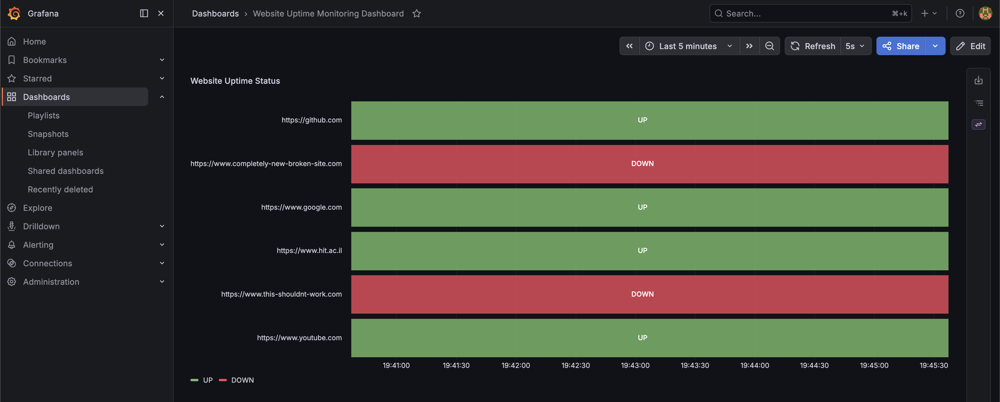
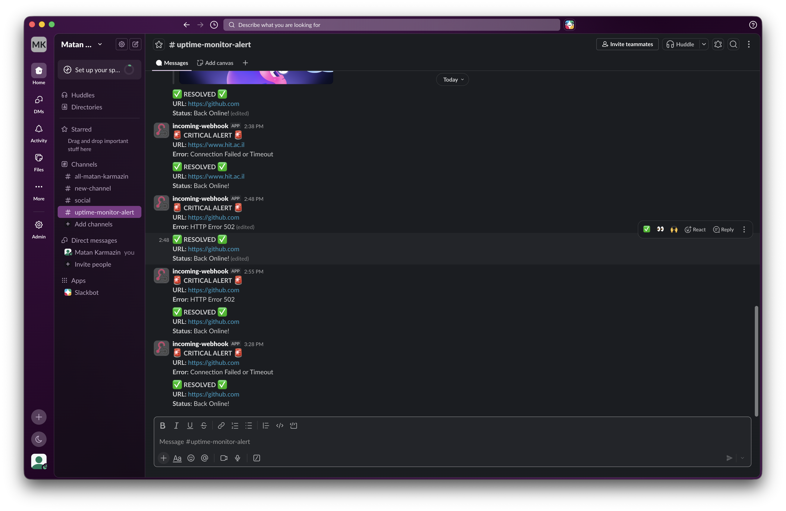
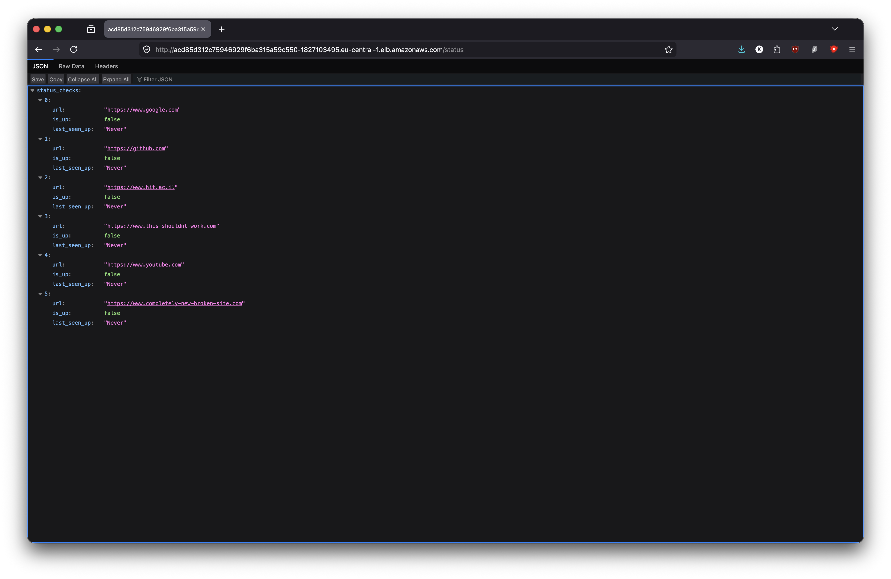

# 🚀 Cloud-Native Uptime Monitor & Alerting Engine


A containerized microservices architecture built to monitor web application availability. Designed with a "DevOps-first" mindset, featuring automated CI/CD pipelines, stateful caching, an asynchronous monitoring engine, a fully provisioned observability stack, and multi-tier cloud orchestration.

## ✨ Features

* **Asynchronous Monitoring Engine:** Utilizes Python's `asyncio` to run non-blocking background workers, ensuring continuous 24/7 health checks completely decoupled from API traffic.
* **Stateful Alerting (Incident Response):** Leverages Redis as an in-memory cache to track the UP/DOWN state of targets. Alerts are dispatched to a Slack Webhook *exclusively* on state changes (e.g., site goes down, or site recovers) to eliminate alert fatigue.
* **Production-Grade Orchestration:** Migrated runtime environment from standalone virtual machines to a highly available **Amazon EKS (Kubernetes)** cluster utilizing declarative manifests for automated deployment scaling and internal service discovery.
* **Dashboards as Code:** Utilizes **Grafana Provisioning** to automatically load pre-configured State Timeline dashboards directly from Git—no manual UI setup required.
* **Infrastructure as Code (IaC):** AWS cloud infrastructure (EKS Cluster, Managed Node Groups, ECR registries, EC2, VPCs, Security Groups) is provisioned automatically and reproducibly using **Terraform**.
* **Zero-Touch CI/CD:** Integrated multi-stage GitHub Actions workflows to automatically run lint/test cycles, compile production Docker images, and securely push assets to **Amazon ECR**.

## 📊 System Observability



## 🚨 Incident Response & Kubernetes Verification





## 🛠️ Tech Stack

* **Backend API:** Python 3.11, FastAPI, Requests, Asyncio
* **Database / Cache:** Redis (Alpine)
* **Observability:** Prometheus, Grafana
* **Orchestration & Cloud:** Kubernetes (EKS), Docker, Amazon ECR, Terraform, AWS (EC2, ELB, VPC)
* **Automation & Alerting:** GitHub Actions (CI/CD), Shell Scripting, Slack Webhooks

## 🚀 Getting Started

### Prerequisites

* Docker Desktop installed and running.
* Git & Terraform installed.
* AWS CLI configured with appropriate IAM deployment permissions.

### 💻 Local Development

1. **Clone the repository:**
   ```bash
   git clone https://github.com/MatanKarmazin/uptime-monitor.git
   cd uptime-monitor
   ```

2. **Configure Environment Variables:**
Create a `.env` file in the root directory to enable local Slack alerts:
   ```env
   SLACK_WEBHOOK_URL=[https://hooks.slack.com/services/YOUR/WEBHOOK/URL
   ```


3. **Launch the stack:**
   ```bash
   docker compose up -d --build
   ```


### ☁️ Cloud Orchestration (Amazon EKS)

The entire cloud infrastructure and Kubernetes deployment lifecycle has been codified into 1-click automation scripts. You do not need to run manual `terraform` or `kubectl` commands.

1. **Deploy the Cluster & Microservices:**
Run the deployment script to provision the AWS EKS cluster, configure local routing, and deploy the Kubernetes manifests:
   ```bash
   chmod +x deploy.sh
   ./deploy.sh
   ```


*(The script takes ~15 minutes to provision the AWS infrastructure and will output your live Elastic Load Balancer URL upon completion).*

## 🧹 Tear Down (1-Click Destroy)

To prevent unexpected AWS cloud costs, the teardown process is fully automated. This script safely destroys all Terraform state resources, EKS clusters, and networking gateways:

   ```bash
   chmod +x destroy.sh
   ./destroy.sh
   ```

## 🏗️ Future Roadmap

* [x] Implement CI/CD pipelines using GitHub Actions for automated testing.
* [x] Add Observability metrics (Prometheus) and visualization dashboards (Grafana).
* [x] Implement "Dashboards as Code" for zero-touch Grafana provisioning.
* [x] Refactor architecture to use asynchronous background workers.
* [x] Deploy cloud infrastructure via Terraform (IaC).
* [x] Implement Continuous Deployment (CD) for automated EC2 rollouts.
* [x] Configure automated Alerting (Slack/Discord Webhooks) for downtime events.
* [x] Migrate runtime environment from Docker Compose on EC2 to **Amazon EKS (Kubernetes)**.
* [ ] Secure the application with a domain name, HTTPS, and Let's Encrypt using an Ingress Controller (Nginx).
* [ ] Integrate HashiCorp Vault or AWS Secrets Manager to completely decouple sensitive credentials from deployment files.
* [ ] Convert the CI/CD pipeline to a full GitOps workflow using ArgoCD to track declarative state configurations directly in Git.